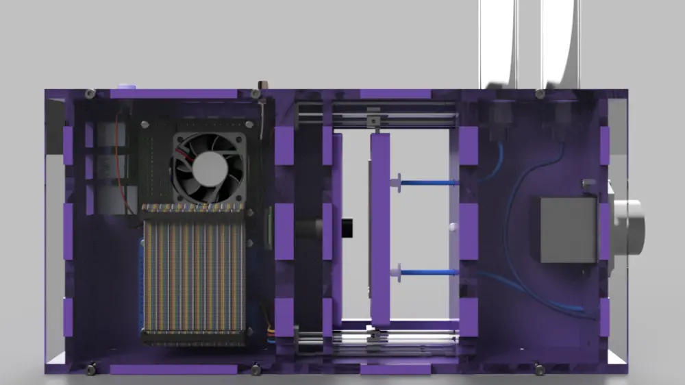
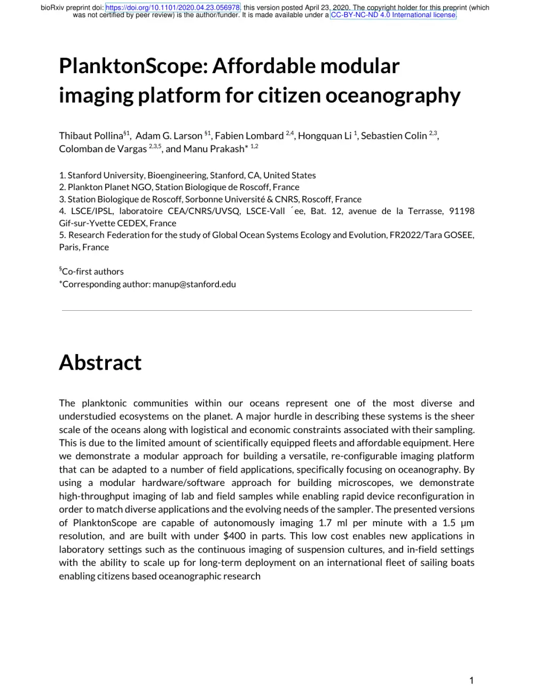
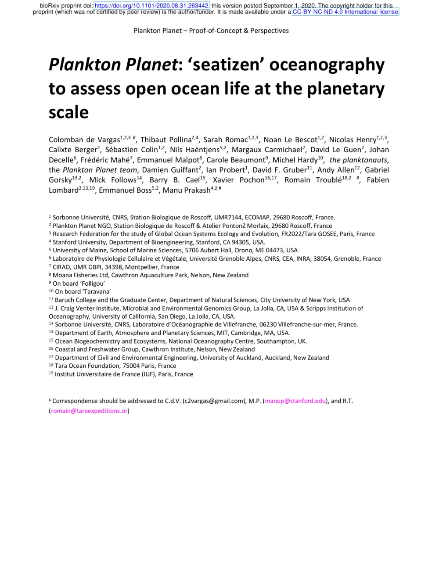

# An open and affordable imaging platform for citizen oceanography

# What is this?
The PlanktoScope is an open-source, affordable imaging platform for citizen oceanography. It's built around a Raspberry Pi, a couple of HATs, some stepper motors and a few centimeters of silicon tubes. Its cost is at about $500 in parts.

The goal of the PlanktoScope is to allow citizen to engage in scientific programs, either at sea or onshore. You can use the PlanktoScope to image the different species of Plankton living in a body of water.

## Get the papers!
The PlanktoScope has been described in a paper available on the [bioRxiv preprint server](https://www.biorxiv.org/content/10.1101/2020.04.23.056978v1). The first results of this program and its outline are also available as a [preprint](https://www.biorxiv.org/content/10.1101/2020.08.31.263442v1).

|||
|--------|--------|

# Key Features
- Image small animals and algae living in water
- Focus stage control
- Pump control
- Automatic image capture
- Automatic segmentation

# How do I build one?
You can access the complete documentation on [Read The Docs](https://planktonscope.readthedocs.io/).

# How do I get involved?
There are several ways to join the development effort, share your progress with your build or just ask for help.

We are using slack as a communication platform between interested parties. You can [request to join by filling this form](https://forms.gle/4JnziFjVgjq56aT17).

This repository is also a good way to get involved. Please fill in an issue if you witnessed a bug in the software or hardware. If you are able, you can also join the development effort. Look through the [issues opened](https://github.com/PlanktonPlanet/PlanktonScope/labels/good%20first%20issue) and choose one that piques your interest. Let us know you want to work on it in the comments, we may even be able to guide your beginnings around the code.