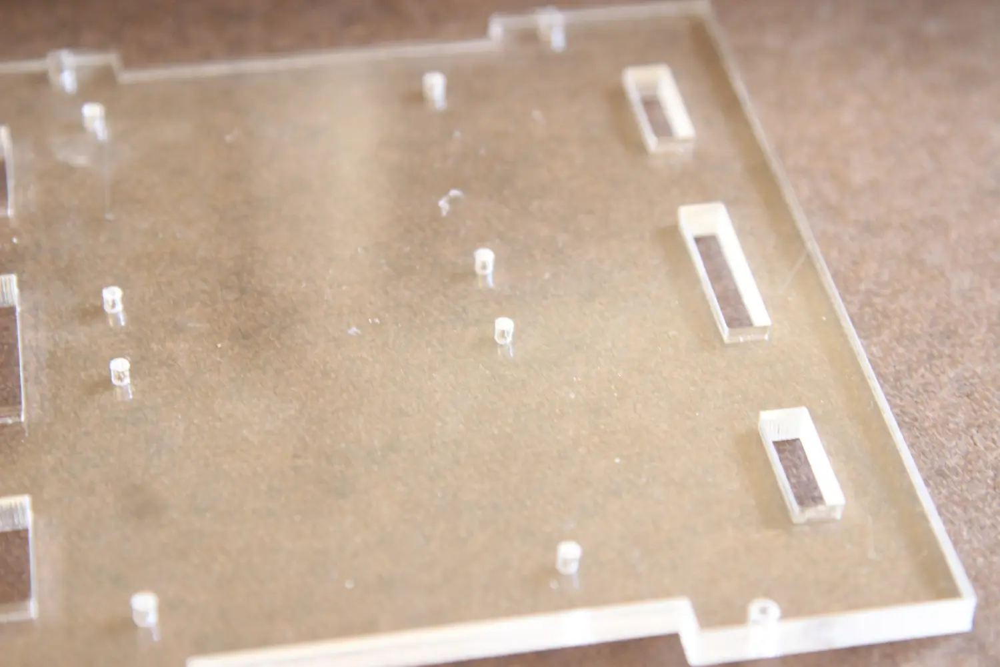
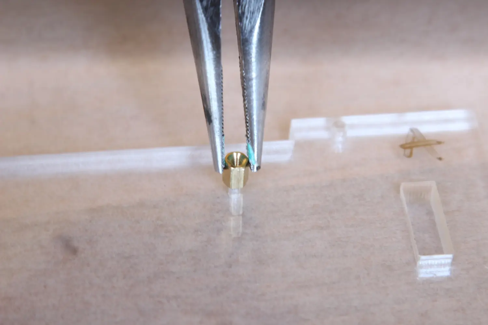
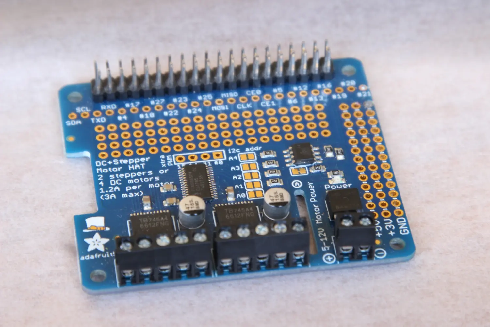
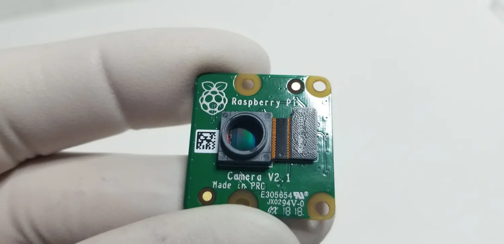
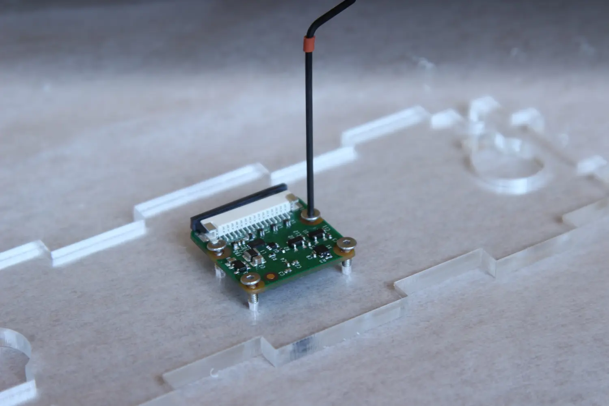

# Assembly guide of the PlanktoScope

## Step 0: Gather everything you need

- Laser cut structure
- M12 lenses
- Peristaltic pump and tubing
- Raspberry Pi, motor driver board, GPIO connectors
- Flashed SD card
- Stepper motors
- PiCam and flex cable
- GPIO ribbon connector, headers, HATs, LED
- DC Power terminal
- Magnets
- Super glue
- Standoffs (M2.5), M3 screws and nuts

Make sure you have your screwdriver kit, soldering iron, and components ready. Also, remember to flash the Planktonscope image disk on the SD card before installing the Raspberry Pi.

If you are not familiar with any process, such as soldering, tapping, or wiring, try and familiarize yourself with the topics first.

Soldering deals with high heat and potentially toxic materials, so make sure to use the proper precautions.

## Step 1: Laser cutting

Laser cut all components using the .ai file ensuring all cuts are complete. The current design should have a 5mm material thickness. Start by placing laser cut base A on a flat workspace. Make sure all holes are complete, and negative space is clear.

## Step 2: Standoff installation

Place 8 standoffs (M2.5 6mm) into the designated holes on the laser-cut base A. A pair of pliers make the job more comfortable. Do not overtighten as it is possible to crack the base material.

## Step 3: Motor HAT preparation

Insert and solder the terminal blocks and headers onto the motor driver PCB. 

Place the motor driver PCB on to the indicated standoffs.

## Step 4: Magnets setup

Now is a good time to think about how the magnets will function within the microscope. The magnets in the sample stage will need to attract to the magnets on the flow cell holder. The magnets in the objective holder will need to attract the magnets on the mount. Keep this in mind as you are adding your magnets and tapping your respective M12 holders so your orientation will be correct.

You can now fix your magnets into their appropriate holes on sample stage **B**.
It is recommended to glue the magnets in place. If the magnets are too large to fit in, the holes can be widened with a handheld drill. However, they should be quite snug in place. Before you glue them in place make sure that the polarity is maintained, as they will be impossible to remove after gluing.

## Step 5: Sample stage assembly

Don’t be alarmed by the color swap, this is the sample stage **B**. You can now fit the pegs on the driver mounts into the corresponding holes on the sample stage. They should be glued in place with superglue or epoxy. You can spin the shaft to align the driver mounts on the 2 steppers if it helps making the process easier.

You should now have a sample stage and motor assembly that looks like this.

## Step 6: Lenses tapping and mounting

You now need to tap the holes for the M12 lenses in stage and mount **M** and **D**. It is helpful for alignment to do both the objeDtive and tube lens mount together. It is important to do this as straight as possible. A drop of mineral or olive oil can help the process. Be careful to use a right-hand tap (that goes down when turning clockwise).

You can now screw the objective lens (the 25mm one) in part **D**.

## Step 7: Camera preparation
You can now unscrew the lens from the Pi camera, being careful not to disturb the sensor below.

## Step 8: Camera mount

You can mount the camera using the appropriate holes on the camera mount **G**. Be careful to avoid getting oil or dust on the sensor.

## Step 9: LED preparation

The LED can then be wired up and put into its mount **F**. If you wire the LED yourself, remember to give enough length to reach the motor driver on the other end of the microscope. You can also add a bit of glue to fix **F** to the motor mount **E** at this time to make assembly easier, though it is not required.

## Step 10: Vertical slices assembly
You can now start placing the motor mount/LED assembly- **B**,

**C**,

**D**,

**E**,

**F**,

and **G** into the base **A**.

## Step 11: Pump setup
The pump can then be mounted in place on **H**. Thread the wires through the hole with the pump tubing pointed toward the holes on the mount.

Fix the pump in place.

## Step 12: Pump mounting
You can now mount the pump on base **A**.

Your setup should look like this. Don't worry about the wiring, we'll have a look at it in the next step!

## Step 13: Motor HAT wiring

You will now want to wire the steppers and pump to the terminals on the motor driver board.

If your wires are too short, you can invert the pump and the focus wiring. However, you will have to remember to change the configuration later on.

## Step 14: Raspberry Pi setup and installation

At this point, you can insert your flashed SD card into your Raspberry Pi. [Consult the guide for flashing your SD card](https://www.planktonscope.org/replicate/prepare-your-pi) before you do this. The heat sink can also be added to the processor.

Mount the Raspberry Pi containing the flashed SD card on the standoffs attached to the laser cut base A.

## Step 15: Standoffs

Add 8 standoffs (M2.5 15mm) to fix the motor driver board and the Raspberry Pi to the base. 

## Step 16: Camera flex cable

At this point you can use the Pi camera flex cable to connect the camera to the Pi. This is done by gently pulling up the tensioners, inserting the cable in the right orientation, then pushing the tensioners back in place to set the cable. Try not to kink or fold the flex cable too much as it is possible to damage it.
