# Assembly guide of the PlanktoScope
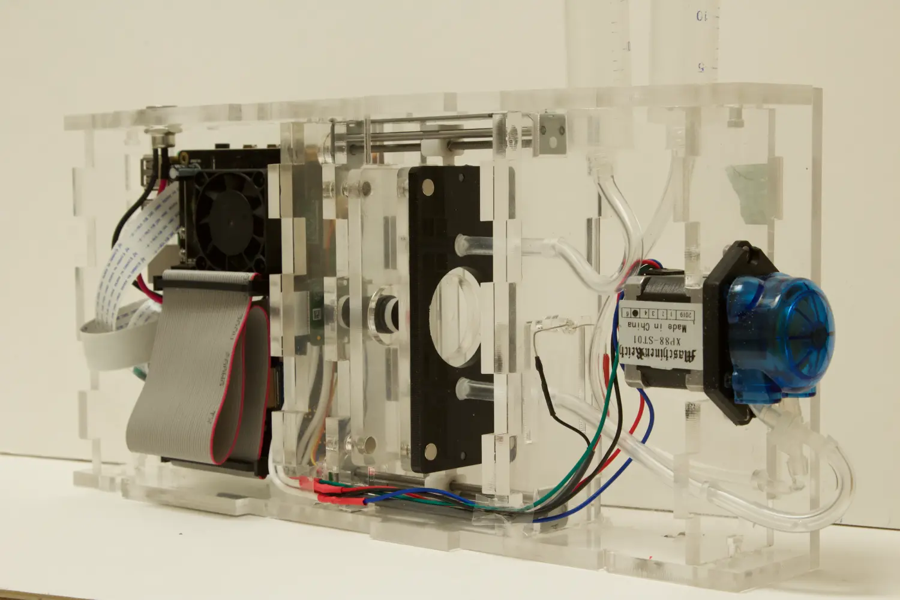

## Step 0: Gather everything you need

- Laser cut structure
- M12 lenses
- Peristaltic pump and tubing
- Raspberry Pi, motor driver board, GPIO connectors
- Flashed SD card
- Stepper motors
- PiCam and flex cable
- GPIO ribbon connector, headers, HATs, LED
- DC Power terminal
- Magnets
- Super glue
- Standoffs (M2.5), M3 screws and nuts

Make sure you have your screwdriver kit, soldering iron, and components ready. Also, remember to flash the Planktonscope image disk on the SD card before installing the Raspberry Pi.

If you are not familiar with any process, such as soldering, tapping, or wiring, try and familiarize yourself with the topics first.

Soldering deals with high heat and potentially toxic materials, so make sure to use the proper precautions.

## Step 1: Laser cutting

Laser cut all components using the .ai file ensuring all cuts are complete. The current design should have a 5mm material thickness. Start by placing laser cut base A on a flat workspace. Make sure all holes are complete, and negative space is clear.

!!! warning
    If you are doing the laser cutting yourself, please take the time to check the calibration of the machine and its power output for the material you are using. A tight fit is needed between the different plates to avoid unwanted play between critical parts.

## Step 2: Standoff installation

Place 8 standoffs (M2.5 6mm) into the designated holes on the laser-cut base A. A pair of pliers make the job more comfortable. Do not overtighten as it is possible to crack the base material.

## Step 3: Motor HAT preparation

Insert and solder the terminal blocks and headers onto the motor driver PCB. 

Place the motor driver PCB on to the indicated standoffs.

## Step 4: Magnets setup
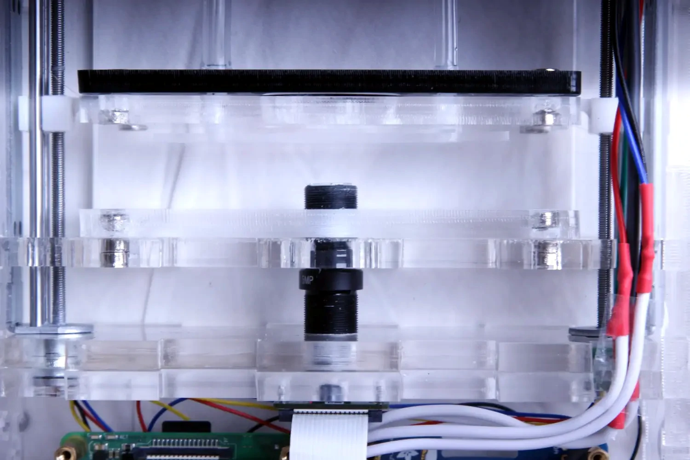

Now is a good time to think about how the magnets will function within the microscope. The magnets in the sample stage will need to attract to the magnets on the flow cell holder. The magnets in the objective holder will need to attract the magnets on the mount. Keep this in mind as you are adding your magnets and tapping your respective M12 holders so your orientation will be correct.

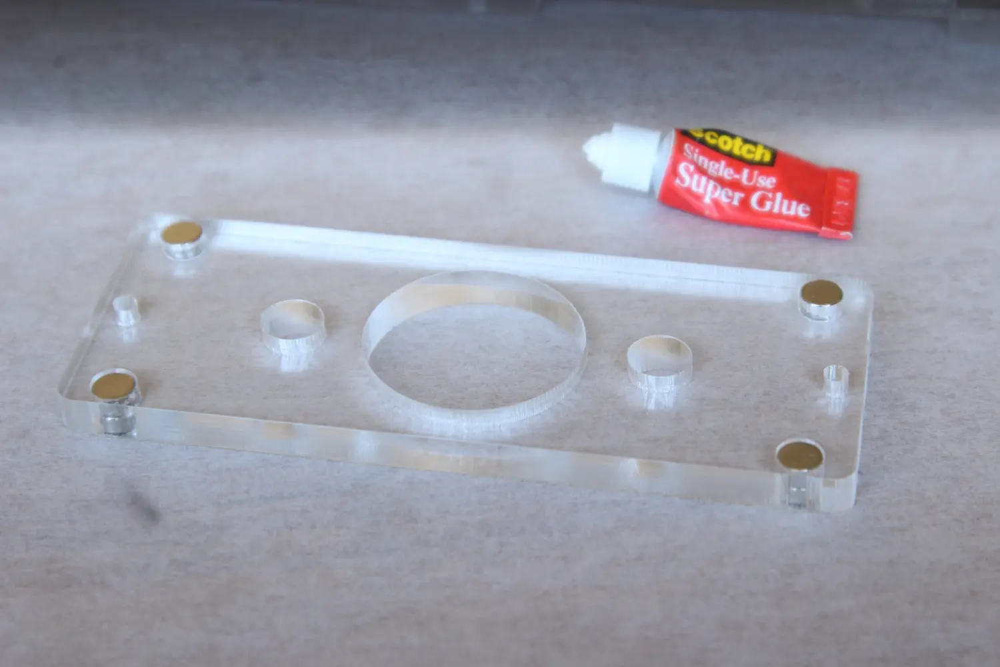

You can now fix your magnets into their appropriate holes on sample stage **B**.
It is recommended to glue the magnets in place. If the magnets are too large to fit in, the holes can be widened with a handheld drill. However, they should be quite snug in place. Before you glue them in place make sure that the polarity is maintained, as they will be impossible to remove after gluing.

## Step 5: Sample stage assembly
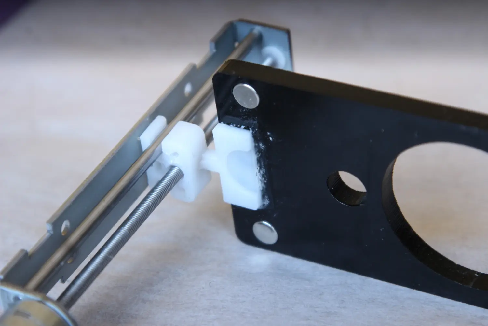

Don’t be alarmed by the color swap, this is the sample stage **B**. You can now fit the pegs on the driver mounts into the corresponding holes on the sample stage. They should be glued in place with superglue or epoxy. You can spin the shaft to align the driver mounts on the 2 steppers if it helps making the process easier.

You should now have a sample stage and motor assembly that looks like this.

## Step 6: Lenses tapping and mounting
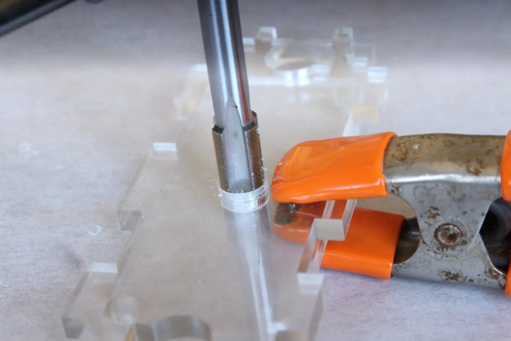

You now need to tap the holes for the M12 lenses in stage and mount **M** and **D**. It is helpful for alignment to do both the objeDtive and tube lens mount together. It is important to do this as straight as possible. A drop of mineral or olive oil can help the process. Be careful to use a right-hand tap (that goes down when turning clockwise).

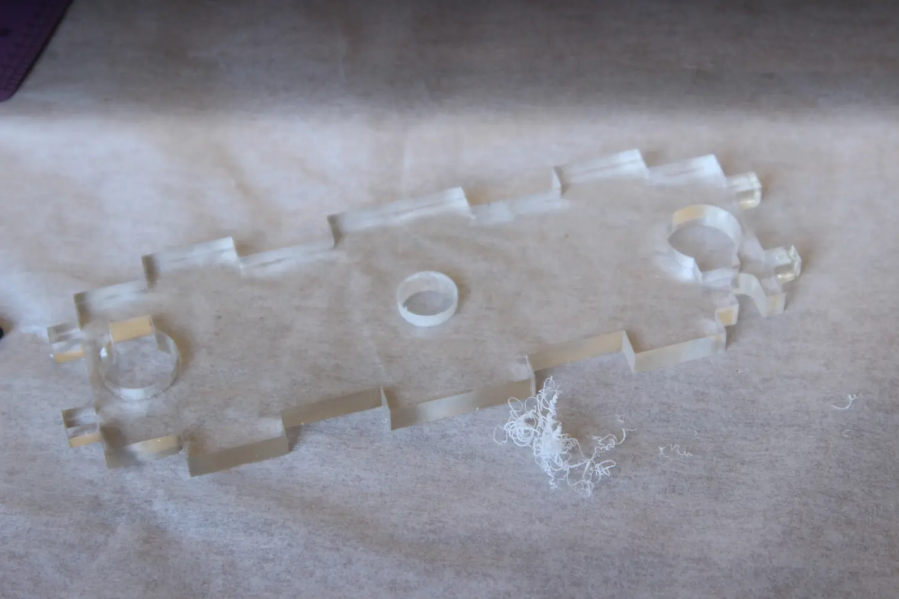

You can now screw the objective lens (the 25mm one) in part **D**.

## Step 7: Camera preparation
You can now unscrew the lens from the Pi camera, being careful not to disturb the sensor below.

## Step 8: Camera mount

You can mount the camera using the appropriate holes on the camera mount **G**. Be careful to avoid getting oil or dust on the sensor.

## Step 9: LED preparation

The LED can then be wired up and put into its mount **F**. If you wire the LED yourself, remember to give enough length to reach the motor driver on the other end of the microscope. You can also add a bit of glue to fix **F** to the motor mount **E** at this time to make assembly easier, though it is not required.

## Step 10: Vertical slices assembly
You can now start placing the motor mount/LED assembly- **B**,
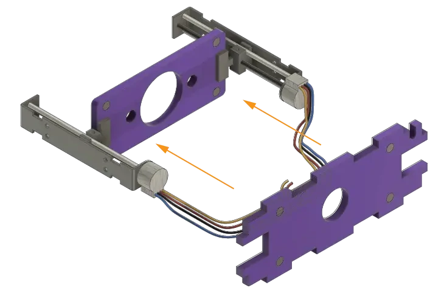

**C**,

**D**,

**E**,

**F**,
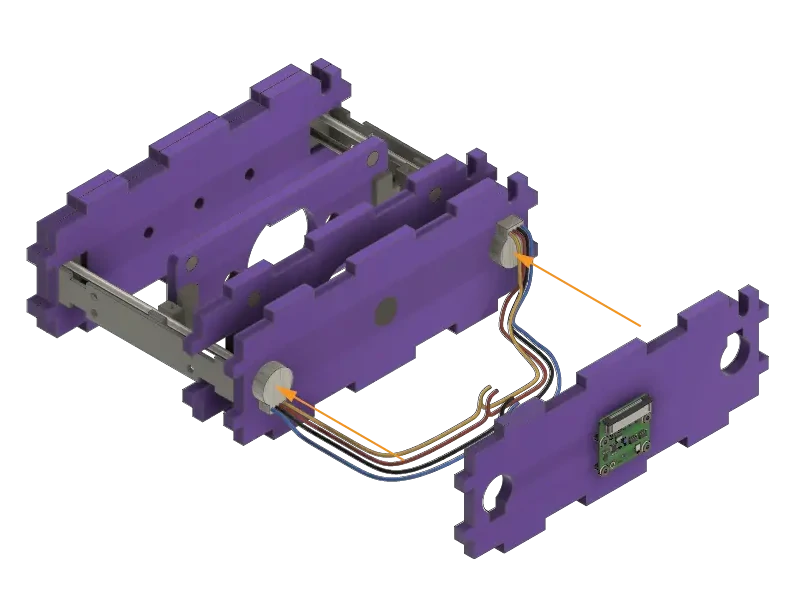

and **G** into the base **A**.

## Step 11: Pump setup
The pump can then be mounted in place on **H**. Thread the wires through the hole with the pump tubing pointed toward the holes on the mount.

Fix the pump in place.

## Step 12: Pump mounting
You can now mount the pump on base **A**.

Your setup should look like this. Don't worry about the wiring, we'll have a look at it in the next step!

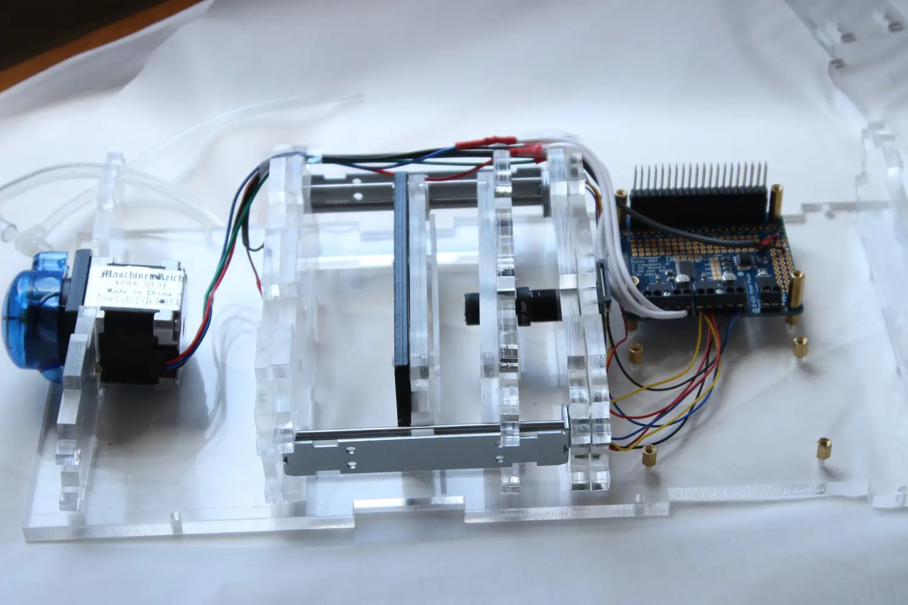

## Step 13: Motor HAT wiring
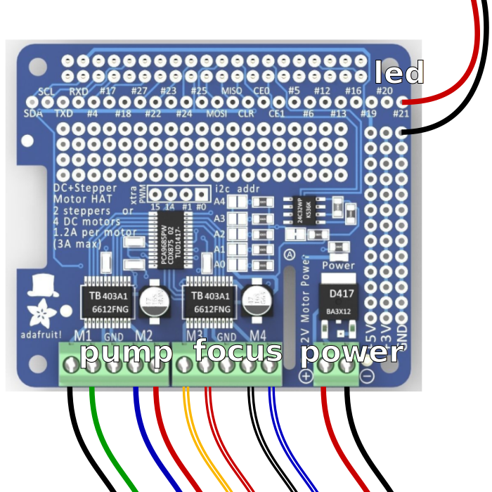

You will now want to wire the steppers and pump to the terminals on the motor driver board.

If your wires are too short, you can invert the pump and the focus wiring. However, you will have to remember to change the configuration later on.

!!! tip
    Make sure the wires are properly connected by pulling on them a little. They should not come loose.

## Step 14: Raspberry Pi setup and installation

At this point, you can insert your flashed SD card into your Raspberry Pi. [Consult the guide for flashing your SD card](https://www.planktonscope.org/replicate/prepare-your-pi) before you do this. The heat sink can also be added to the processor.

!!! note
    If you choose the Expert path, you still need to flash your sd card, either with the [lite version](https://downloads.raspberrypi.org/raspios_lite_armhf_latest) of Raspberry OS or with the [desktop version](https://downloads.raspberrypi.org/raspios_armhf_latest).

Mount the Raspberry Pi containing the flashed SD card on the standoffs attached to the laser cut base A.

## Step 15: Standoffs

Add 8 standoffs (M2.5 15mm) to fix the motor driver board and the Raspberry Pi to the base. 

## Step 16: Camera flex cable
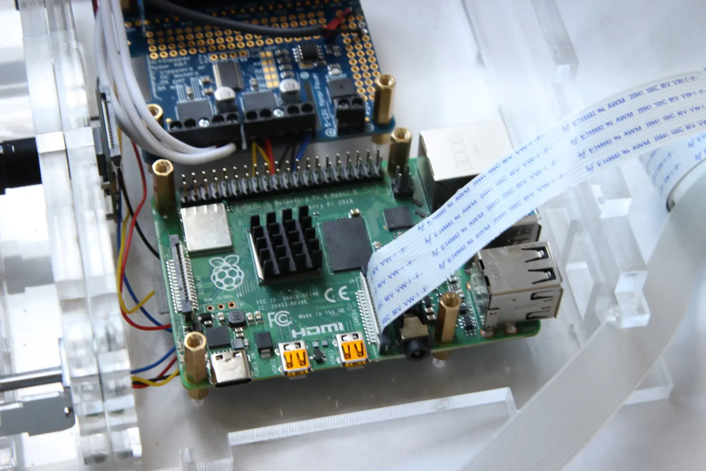

At this point you can use the Pi camera flex cable to connect the camera to the Pi. This is done by gently pulling up the tensioners, inserting the cable in the right orientation, then pushing the tensioners back in place to set the cable. Try not to kink or fold the flex cable too much as it is possible to damage it.

## Step 17: Power supply wiring
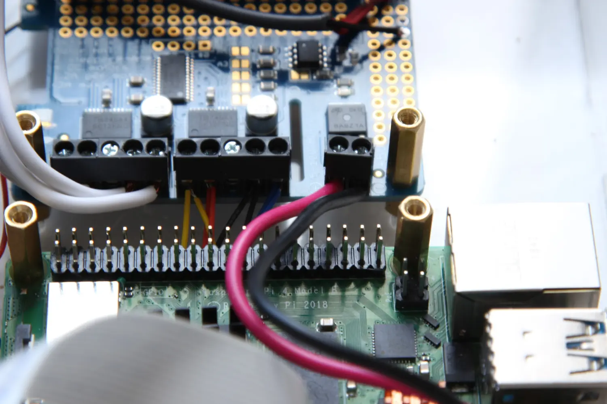

The power wires can be wired into place on the motor driver board.

!!! tip
    Make sure the wires are properly connected by pulling on them a little. They should not come loose.

## Step 18: Prepare the GPS HAT
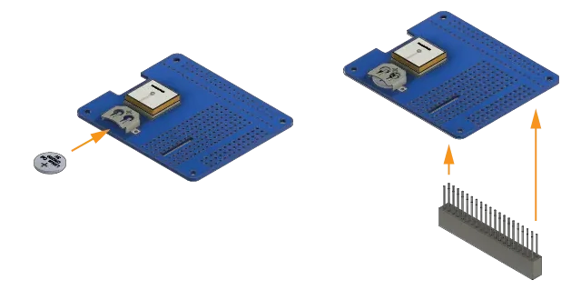

Insert the battery to power the GPS HAT and solder the terminal mounts in place.

## Step 19: Install the GPS HAT

Mount the GPS HAT over the motor driver PCB using the standoffs attached to the laser cut base **A**.

## Step 20: Install the Fan HAT

Place the cooling fan HAT above the Raspberry Pi by mounting it to the standoffs on base **A**.

!!! warning
    Be careful to slide the camera flat cable in the slot in the HAT above the connector.

## Step 21: Secure the HATS
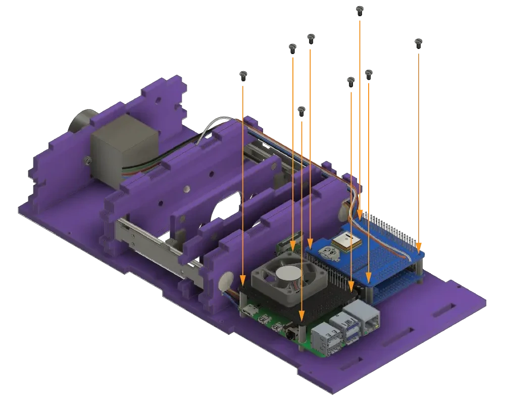

Secure the cooling fan HAT and GPS HAT by tightening the 8 screws to the standoffs on base A

## Step 22: Install back panel

Insert the laser cut border **I** into base **A**.

## Step 23: GPS output connector

Insert the power and GPS connectors into side plate **J**.

## Step 24: Install side panel

Place the side plate **J** into the designated slots on the base. You can connect the GPS cable to its connector on the board.

!!! warning
    The GPS connector is quite fragile, make sure to align it properly before inserting it.

## Step 25: Install the other side panel
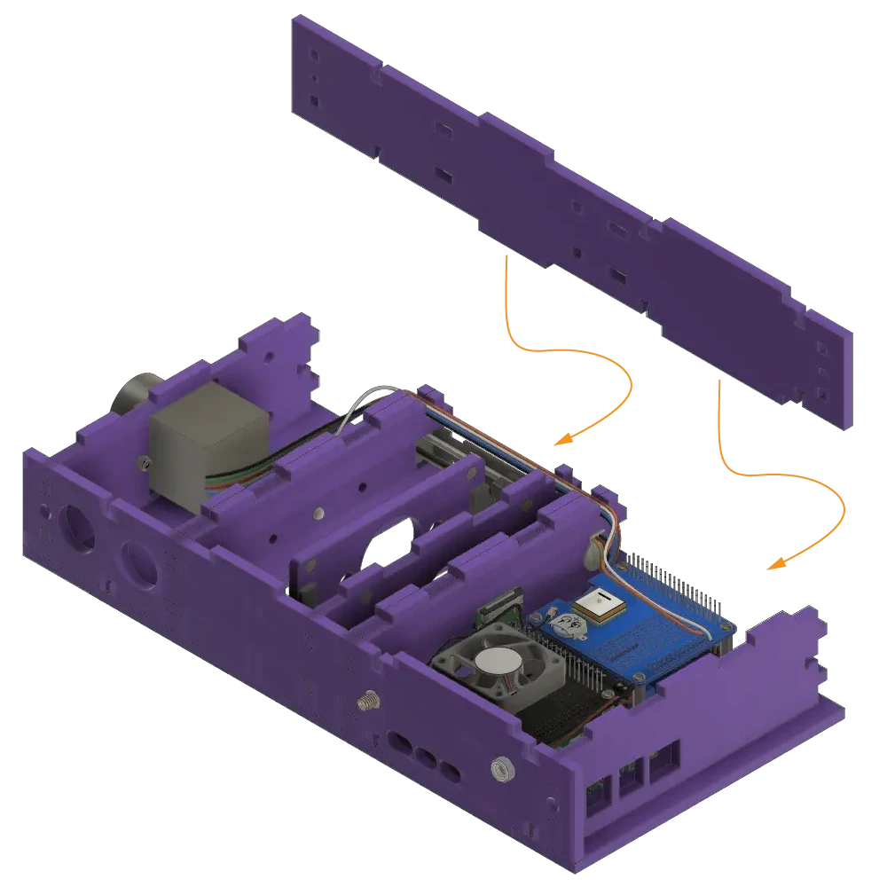

Mount the side plate **K** on base **A** using the assigned slots.

## Step 26: Secure the sides together
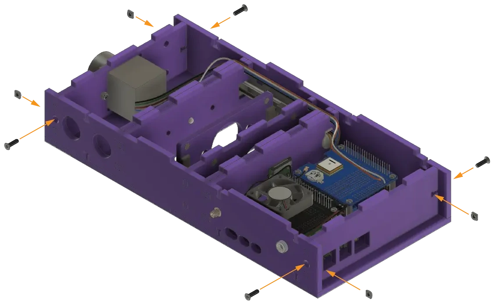

Secure the laser cut sides with the screws and nuts.

## Step 27: Secure the sides to the base plate

Secure the laser cut sides to the base plate **A** with the screws and nuts.

!!! warning
    To make this easier, you can turn the assembly upside down or on its side. Be careful when doing so as the plates may fall.

## Step 28: Insert the camera ribbon cable in the camera

You can now connect the camera flex cable into the connector on the camera board. Once again, gently pull up the tensioners, insert the cable in the right orientation, and push the tensioners back in place to set the cable. Try not to kink or fold the flex cable too much as it is possible to damage it. 

## Step 29: Insert the ribbon cable
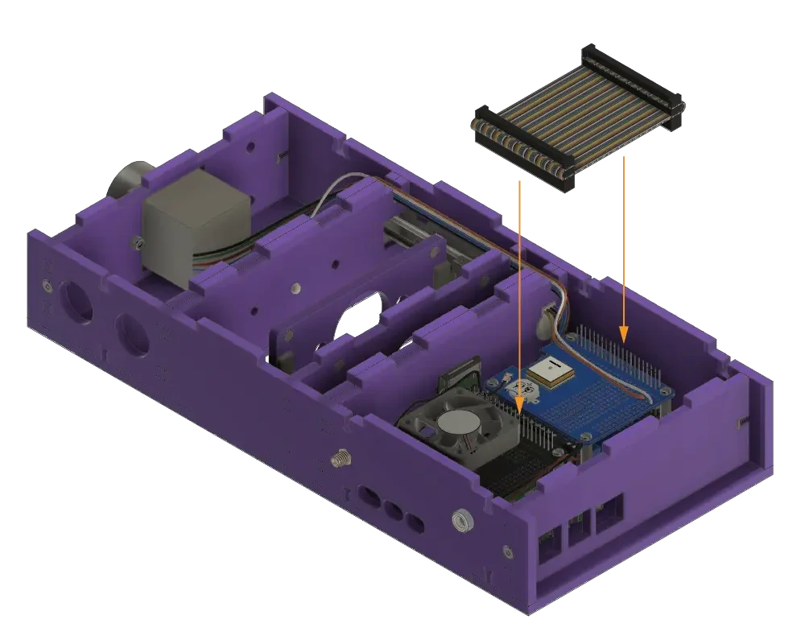

Attach the GPIO ribbon to connect the cooling fan HAT to the GPS HAT.

!!! tip
    You can try to route the flat ribbon from the camera under the ribbon cable you are connecting now.
    

## Step 30: Fluidic assembly
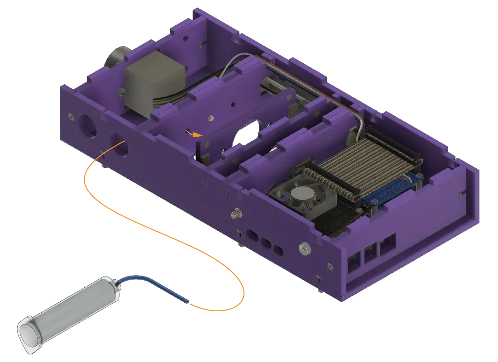

Feed in the tubing from syringe 1 to form the fluidic path as shown.

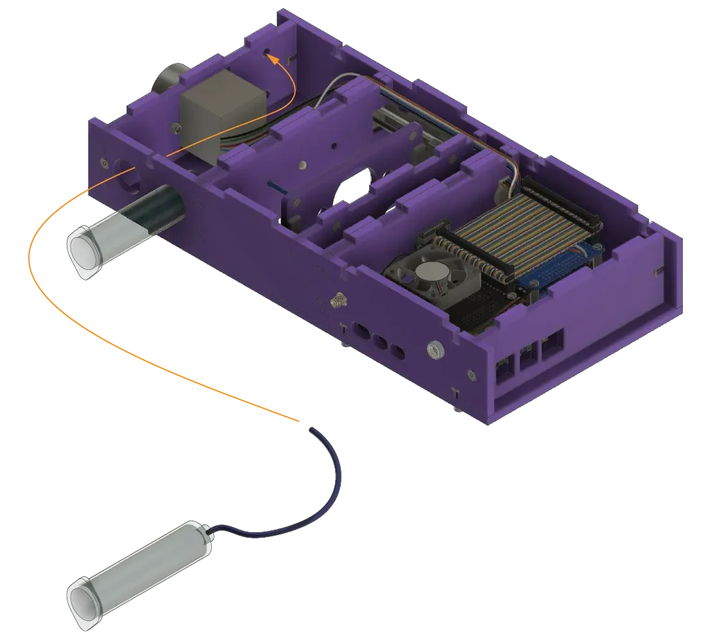

Feed in the tubing from syringe 2 to form the fluidic path as shown

Feed in a length of tubing as shown through motor mount **H** and illumination mount **FE**

## Step 31: Close your PlanktoScope

!!! warning
    Take a moment to check your wiring one last time. Also check the routing, make sure the LED wires and the pump stepper wires are in their dedicated channel.

Place the top **L** into the slots on the Planktonscope body. Secure it in place with screws and nuts.

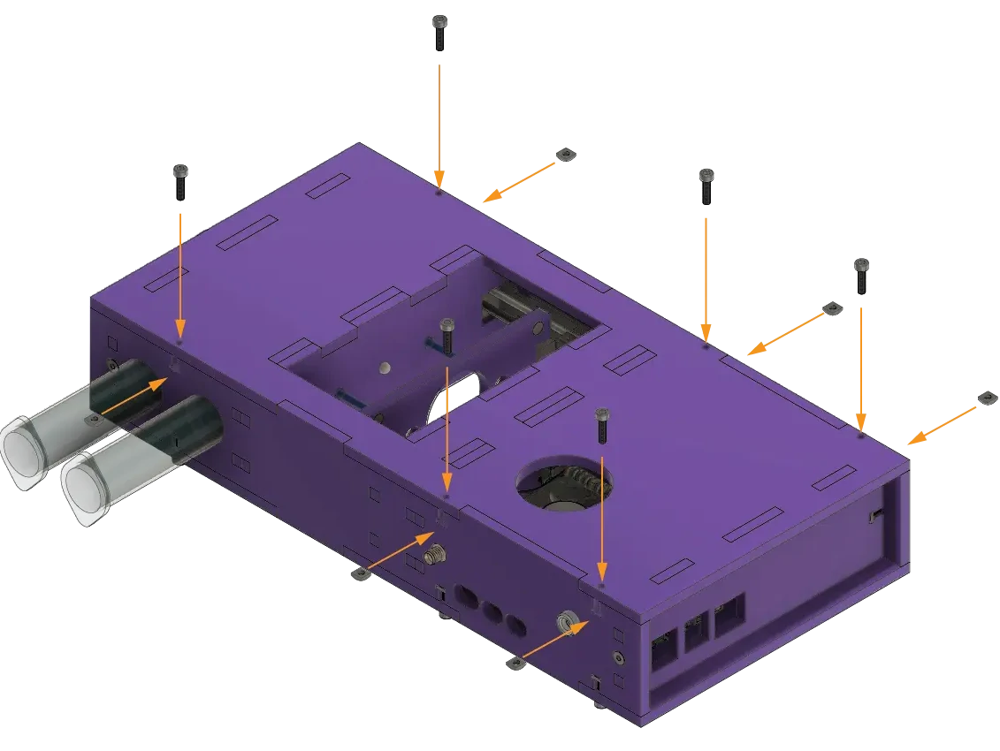

## Step 32: Enjoy!

Congratulations on a job well done. You can have some rest, get a tea and some biscuits!

You can now plug the machine in and test it. If you have choose the Expert's path, now is a good time to [finish setting up your machine](expert_setup.md).
